# MTVS_Nebula
  - 메타버스 아카데미 최종 프로젝트(2022.10.4 ~ 2022.12.1)  
  - 🏆 최종 성과공유회 장려상(한국전파진흥협회장)  
  - [프로젝트 pdf](https://github.com/mass1129/MTVS_Nebula/blob/mass7/Image/52Hertz_Nebula_MTVS.pdf) 
  - [팀 깃허브](https://github.com/MTVS-Nebula)

## 애플리케이션 개요
  - 메타버스 소셜 네트워크 서비스  
  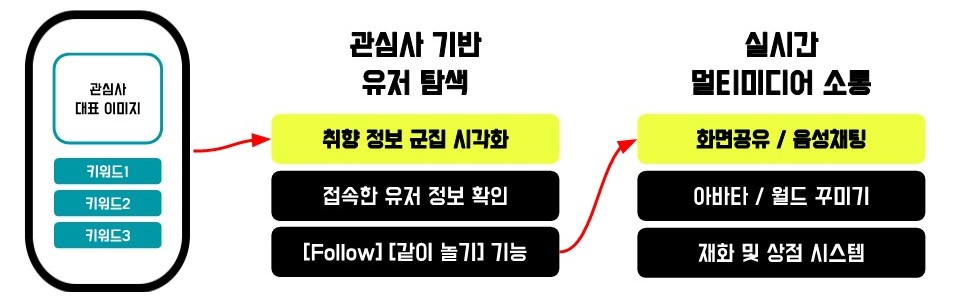  

## 애플리케이션 시연 영상
[](https://youtu.be/CWq_pdrmocA)
      

## 팀 구성 및 역할
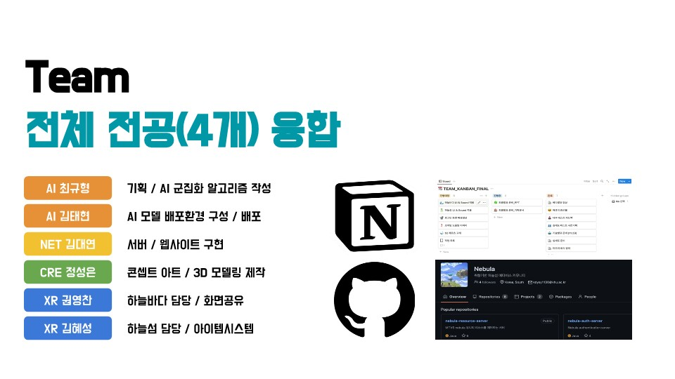  

## 기술 융합 구조도
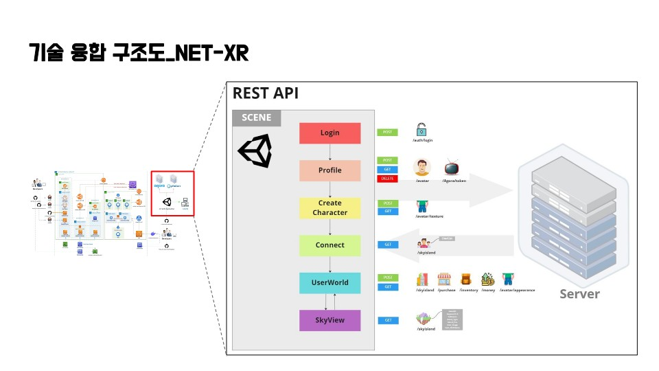  

----
# 주요 구현 요소(김혜성) : 유저 월드 담당  
  
## 프로토타입 개발 및 영상 제작  (10/5 - 10/10)  
[](https://youtu.be/HBiD05-DEZE)

## HTTP 통신 모듈 제작  
  - [Assets/Scripts/K_Script/Http](https://github.com/mass1129/MTVS_Nebula/tree/mass7/Assets/Scripts/K_Script/Http)  
  - Unitask를 활용한 비동기 통신 구조   
    ```C#
    public async UniTask Post(string url, string json)
    ```
  - 어디서든 인스턴스화 가능한 모듈  
    ```C#
    //인스턴스화 예시  
    var httpReq = new HttpRequester(new JsonSerializationOption());
    await httpReq.Post(url, json);
    ```
  - Generic를 사용하여 코드 재사용  
    ```C#
    public async UniTask<TResultType> Get<TResultType>(string url)
    ```
    예시  
    ```C#
    //어떤 클래스든 역직렬화 가능  
    H_I_Root result2 = await httpReq.Get<H_I_Root>(url);
    Inventory newInven = result2.results;
    ```
  - 인터페이스를 통한 전략 패턴으로 종속성 삭제 및 이후 시스템 확장시 ContentType과 직렬화/역직렬화 방식을 유연하게 수정할 수 있도록 함  
    ```C#
    public interface ISerializationOption
    {   
        string ContentType { get; }
        T Deserialize<T>(string text);
    }
    ```
## 아이템 시스템  
  - 구현 Gif  
    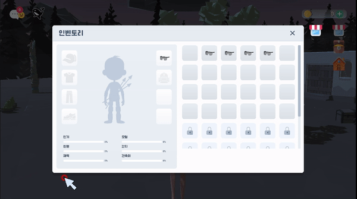</img>  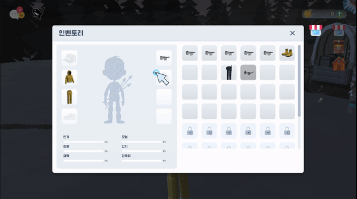</img>  
  - 유니티의 Scriptable Object를 활용하여 설계  
      - 유니티에서 제공하는 대량의 데이터를 저장하는 데이터 컨테이너  
      - 인스턴스화 될때 데이터에 대한 사본을 생성하지 않고 메모리(힙)에 Scriptable Object의 데이터 사본만을 저장하고 이를 참조하는 방식 -> 메모리 사용 줄일 수 있다.  
      - json 정적 데이터를 런타임에서 바로 읽는것이 아니라 SCriptable Object에 먼저 파싱하고 읽음으로서 성능 최적화 효과  
  - **ItemObject.cs : Scriptable Object** : 아이템의 모든 정보를 저장한 스크립터블 오브젝트  
    
      -  직렬화하는 정보는 Data(item 클래스)뿐 나머지 정보는 클라이언트에 에셋 형태로 저장  
          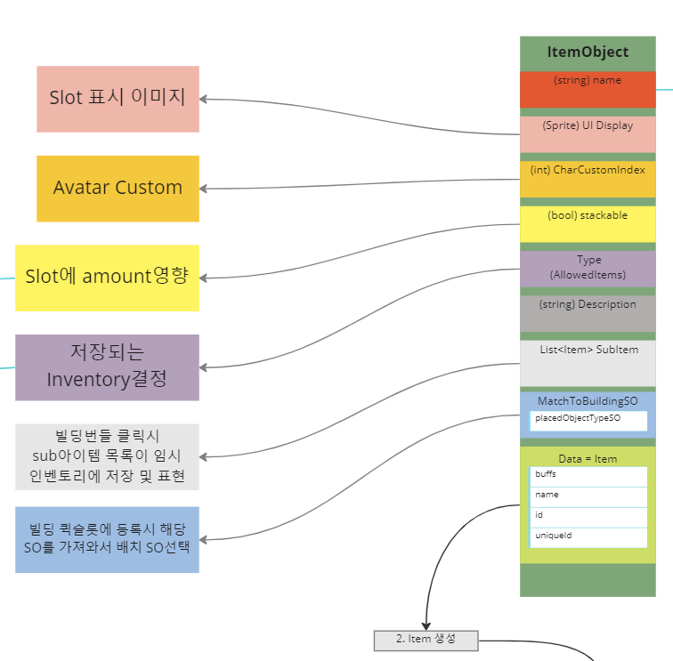  
   
  - **ItemDatabaseObject.cs : Scriptable Object** : 모든 아이템 Scriptable Object를 배열로 저장해 놓은 아이템 데이터베이스  
    - 아이템를 만들고 데이터베이스에 추가시 id가 자동으로 업데이트(유니티에서 제공하는 OnValidate() 메소드 사용, 또는 인스펙터에서 Update ID's 클릭)    
  - **Item.cs** : 서버와 주고 받을 직렬화 아이템 데이터 클래스  
    - 생성자  
      - Item() : 아이템 초기화(id = -1 => item = null)
      - Item(ItemObject item) : 아이템 Scriptable Object 데이터로 세팅된 아이템 생성  
      
  - **InventorySlot.cs** : 인벤토리를 구성하는 단위   
    - **field**
      - 직렬화 데이터 : 해당 슬롯에 있는 아이템, 해당 아이템 개수, 저장할수있는 아이템 타입 배열
      - 기타 속성 : 관련 UI, 슬롯 디스플레이
      - 슬롯 업데이트 전후 ~~Action~~ 이벤트   
    - **Method**  
      - **ItemObject GetItemObject()** : 아이템의 id로 아이템 데이터 베이스에 등록된 ItemObject를 찾아서 반환  
      - **void UpdateSlot(Item itemValue, int amountValue)** : **슬롯을 업데이트하는 핵심 메서드**    
        ```C#
        public void UpdateSlot(Item itemValue, int amountValue)
        {
            onBeforeUpdated?.Invoke(this); //슬롯 업데이트 전 event (ex.아이템에 의한 능력치 제거) 
            item = itemValue;
            amount = amountValue;  //슬롯 아이템 변경  
            onAfterUpdated?.Invoke(this); //슬롯 업데이트 후 event   (ex. UI 슬롯 이미지 변경, 장비 입기/벗기, 아이템에 의한 능력치 추가)
        }
        ```
      - **bool CanPlaceInSlot(ItemObject itemObject)** : 아이템 드래그&드롭시 해당 슬롯에 배치할 수 있는지 여부 체크  
  
  - **InventoryObject.cs : Scriptable Object** : 인벤토리의 정보를 저장하는 Scriptable Object  
    - **field**  
      - 직렬화 데이터 : Inventory 클래스(InventorySlot[]로 이루어짐)  
          ```C#
          [SerializeField]
          private Inventory Container = new Inventory(); // 에디터상에서 인벤토리 Scriptable Object 생성시에만 호출  

          public InventorySlot[] GetSlots => Container.slots; //읽기 전용 인벤토리 슬롯  
          ```
      - 기타 속성 : Save & Load api 호출 경로, ItemDatabaseObject, UI타입  
    - **Method**  
      - **void AddBundleListToWindow(ItemObject[] bundleList)** : ItemObject.cs의 subItem[]배열를 받아 빌딩번들 리스트(InventoryObject로 관리)에 추가  
      - **void SwapItems(InventorySlot dragExitSlot, InventorySlot dragStartSlot)** : UI상에서 드래그&드롭시 슬롯 위치 변경  
      - **Inventory GetInventory()** : 직렬화 데이터(Inventory) return - equipment와 clothes 인벤토리는 데이터 멱등성 유지를 위해 함께 저장하는데 이때 필요  
      - **void UpdateInventory()** : 인벤토리가 로드되고 슬롯 event에 관련 메서드가 참조되면(UI와 장비에서) 해당 메소드가 스킵되기 때문에 event에 메서드를 등록후 해당 메서드를 호출하기 위해 만든 메서드  
      - **async UniTask InventorySave(string s)** : 비동기 인벤토리 세이브 메서드  
      - **async UniTask InventoryLoad(string s)** : 비동기 인벤토리 로드 메서드   
      - **async UniTask ForGiveItem(InventorySlot dropSlot, string avatarName)** : 비동기 아이템 소유권 포기 후 인벤토리 로드 메서드(데이터 멱등성 유지)    
      
  - **Inventory.cs** : 서버와 주고 받을 인벤토리 데이터 클래스(InventorySlot[]으로 구성)    
  - **Inventory 데이터 Post/Get 구조도**  
     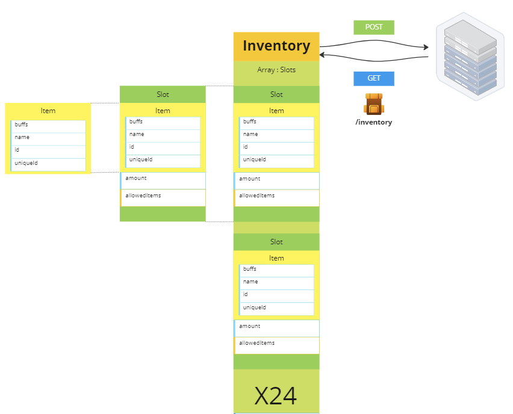  
  - **Inventory 전체 구조도 : NetWork 파트와 관련 정보를 공유하기 위함**  
     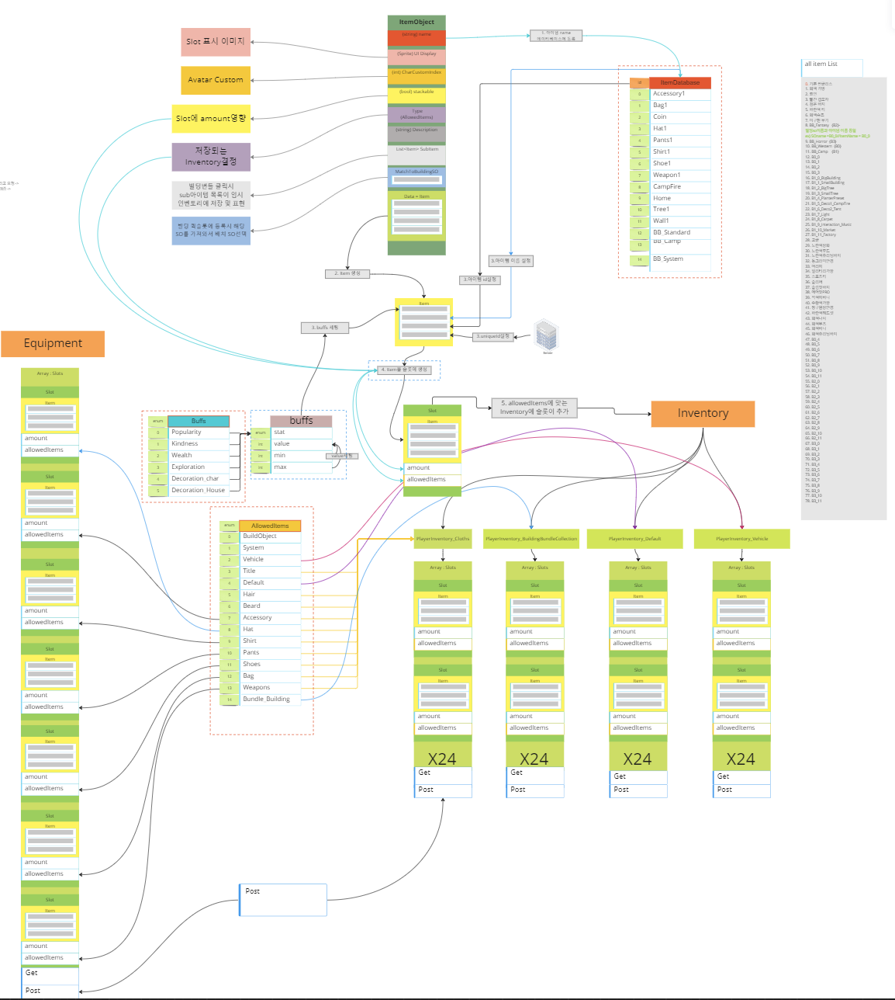  
  - **Inventory Network 파트 구조도**  
     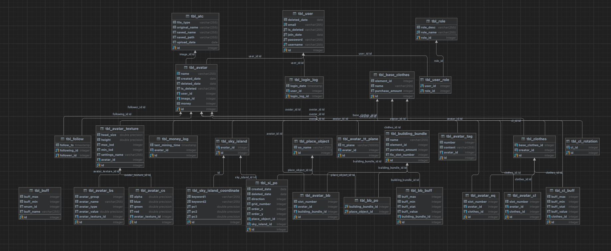  
  ### PlayerItemSystem.cs
  - **개요** : 플레이어의 전반적인 inventory를 관리(저장/불러오기) => 그렇기 때문에 플레이어 생성시 플레이어 세팅, 아바타 장비 장착 시스템  
  - **Function**  
    - **UniTask SetItemSystem(string s)** : 플레이어 세팅 메소드
      - 플레이어가 처음 생성되면 각 클래스에서 세팅 메서드를 순차적으로 실행해야 하기에 순서를 이 클래스에서 관리  
      - 순서  
        아바타 클래스(캐릭터 텍스쳐 Load) -> 장비 슬롯 event에 메서드 참조 -> 플레이어 스탯 시스템 세팅 -> 이후 아이템 로드를 통해 슬롯 event에 참조된 모든 메서드가 실행되면서 정상적으로 플레이어가 로드  
    - **void OnEquipItem(InventorySlot slot)** : 슬롯 event 참조 메서드 => 아이템 장착에 따른 캐릭터 비주얼 업데이트  
    - **UniTask TwoInvenSave()** : 네트워크 파트에서 아이템 세이브 시 데이터 멱등성 유지를 위해(해킹 방지) 클라이언트에서 보내는 저장 데이터와 기존 서버 데이터 베이스에 있는 인벤토리 정보를 비교 한다고 함, 이 때장비-옷 통합 인벤토리가 필요하다고 해서 하나의 인벤토리 저장 메서드는 있지만 통합 인벤토리 저장 메서드를 따로 만들었다.   


## UI - Inventory  
 - 개요  
    - 추상클래스를 상속받음으로서 **슬롯 세팅 - CreateSlots()** / **슬롯 event 참조 메서드 - OnSlotUpdate(InventorySlot)** 를 자식 클래스에서 반드시 구현하도록 함.  
    - 또 한가지 이유는 UI type 별로 위에 기술한 두가지 메서드가 다르기 때문이다.  
    - 세팅시 슬롯마다 등록하는 UI이벤트 메소드들은 자식 클래스에서 공통으로 사용하므로 추상클래스에 선언 후 자식클래스에서 구현하는 CreateSlots()에서 사용  
      
 - **K_UserInterface.cs : 추상 클래스**  
    -  **abstract Function**  
        -  void CreateSlots() : 슬롯 세팅  
        -  void OnSlotUpdate(InventorySlot slot) : 슬롯 업데이트시 호출되는 event    
    -  **Function**  
        -  void AddEvent(GameObject obj, EventTriggerType type, UnityAction\<BaseEventData> action) : 오브젝트(슬롯 or UI창), EventTriggerType, Action를 매개변수로 받아서 이벤트를 등록하는 메소드  
    -  **Action** : MouseData라는 static클래스에 필드 값을 EventTriggerType 마다 설정한다.  
        - **UI 창에 적용** 
        - void OnEnterInterface(GameObject obj) : 마우스가 UI상에 있을 때 MouseData.interfaceMouseIsOver = 해당 UI의 K_UserInterface  
        - void OnExitInterface(GameObject obj) : 마우스가 UI에서 이탈할 때 MouseData.interfaceMouseIsOver = null  
        - **슬롯에 적용**
        - void OnEnter(GameObject obj) : 마우스가 슬롯 안에 있을 때 MouseData.slotHoveredOver = obj  
        - void OnExit(GameObject obj) : 마우스가 슬롯에서 나갈 때 MouseData.slotHoveredOver = null  
        - void OnDragStart(GameObject obj) : 슬롯 드래그 시작할 때 MouseData.tempItemBeingDragged = CreateTempItem(obj) => 슬롯 이미지 복사본 생성  
        - void OnDrag(GameObject obj) : 슬롯 드래그 중일 때 슬롯 이미지 복사본 마우스 커서 위치로 세팅  
        - void OnDragEnd(GameObject obj) : 드래그 종료시 복사본 삭제, 마우스가 슬롯 위에 있을시 슬롯 스왑, 마우스가 UI 밖에 있을때 아이템 포기  
        - GameObject CreateTempItem(GameObject obj) : 이미지 복사본 오브젝트를 생성 기능  
- **자식 클래스** : 장비, 옷, 빌딩 퀵슬롯, 상점 UI  
  
|   |  <center>K_EquipmentInterface</center> |  <center>K_ClothesInterface</center> |<center>K_BuildingQuickSlotInterface</center> |  <center>K_ShopListInterface</center> |
|:--------:|:--------:|:--------:|:--------:|:--------:|
|**등록 이벤트 개수** | <center>7 </center> | <center>7 </center> |<center>0 </center> |<center>0 </center> |
|**슬롯 업데이트 event** | <center>img 업뎃 + 디폴드 img on/off </center> |<center>img 업뎃 </center> |<center>img 업뎃 </center> |<center>전용 슬롯 업뎃 함수, 버튼 onClick 등록</center> |
|**슬롯 parent설정 여부** | <center> X </center> |<center>O </center>|<center>O </center> |<center>X </center> |
|**비고** | <center> - </center> |<center>- </center>|<center>- </center> |<center>상점 시스템 참조 </center> |
  
## 게임 머니 및 상점 시스템  
 - 개요  
    - 플레이어의 게임 머니를 관리하고 상점 시스템을 통해 아이템을 살 수 있다.  
    - 플레이어는 재화 생산 건물을 자신의 월드에 배치하면 현재 자신의 월드에 있는 사람의 수에 비례해 더 많은 게임머니를 얻을 수 있다.  
    - 상점에서는 서버측에서 정한 아이템들을 살 수 있으며 장비 아이템의 경우 능력치 랜덤 부여 시스템이 있어 더 좋은 능력치의 아이템을 얻기위해 같은 아이템을 계속 살 수 있다.  
    - 건물 번들 같은 경우 자신에게 없는 건물 번들만 상점에 보여지며 구매시 리스트에서 없어진다.  
    - 아이템을 구매시 클라이언트 데이터(머니, 상점물품, 인벤토리 등)에는 아무 변화가 없고 **서버측 데이터가 변경**된다. 
    - **따라서 아이템 구매시 서버측에 관련 데이터 갱신 요청을 보내야한다.**  
    - 게임 머니 획득 및 소비, 능력치 랜덤 부여, 상점 아이템 갱신 등 모두 서버측에서 이루어지며 클라이언트에는 관련한 그 어떤 데이터도 저장하거나 읽지 않는다.  
 - **K_MoneySystem.cs**  
    -  **자동 구현 프로퍼티**  
        - **public int GoldAmount { get; private set; }** : 게임 머니같은 경우는 보안이 중요하기 때문에 자동 구현 프로퍼티를 통해 클래스 외부에서는 읽을수만 있고 내부에서만 쓸 수있도록 하였다. 
    -  **Function**  
        -  **void MoneySystemSetting(string s)** : **머니시스템 세팅 메소드** - 관련 속성과 참조 값 세팅 및 머니 로드 코루틴 시작  
        -  **IEnumerator MoneyCoroutine()** : 5초마다 머니 로드 코루틴   
        -  **UniTaskVoid MoneyLoad()** : 서버에 머니 정보 요청 및 관련 이벤트 호출
        -  **UniTaskVoid BuyClothesEvent(ItemObject item)** : 옷 구매 요청 - 아이템의 이름을 Json형태로 보내고 구매 성공시 옷 인벤토리 Load, 머니 Load  
        -  **UniTaskVoid BuyBBundleEvent(ItemObject item)** : 건물 번들 구매 요청 - 빌딩 인벤 Load, 머니 Load, **+상점 물품 목록 Load**  
 - **K_MoneyUI.cs** : 게임 머니 UI를 관리하는 클래스  
    - 해당 클래스를 사용하는 머니 UI는 2개이다. 
    - 화면 상단에 항상 있는 UI와 상점 탭을 눌렀을때 보여지는 UI  
    - 상점 탭을 눌렀을때 보여지는 UI는 평상시에는 비활성화 되어 있기 때문에 이벤트가 정상적으로 가지 않기 때문에 OnEnable()에 머니시스템 이벤트에 참조 메서드는 한번만 등록하되 머니 UI갱신은 OnEnable될때마다 계속 호출되도록 하였다. 
  
 - **K_ShopListInterface.cs**  
    -  **개요**  
        - 상점 UI를 담당하는 **K_UserInterface**를 상속받는 자식 클래스  
        - 하지만 네트워크에서 받아오는 상점 아이템의 데이터가 기존 아이템 데이터와 다르기 때문에 많이 커스텀 해야했다.  
           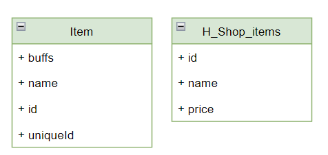   
    - **Field** 
      - 부모 클래스에서는 Dictionary<GameObject, InventorySlot> 형태의 딕션어리를 사용했다. 왜냐면 인벤토리 슬롯 드래그/드롭시 해당 슬롯 GameObject를 Key값으로 InventorySlot을 찾아야 했기 때문인다.  
      - 이미지만 갱신하면 되었던 기존 UI와는 다르게 상점 UI는 이미지, discription, 가격, 등등 많은 것들을 갱신해줘야했다. 
      - 따라서 **샵 아이템 슬롯 모듈 클래스\(ShopSlotModule.cs)** 를 만들어서 갱신해야하는 속성들을 필드에 선언하고 세팅해주는 메서드를 만들고 이것을 슬롯 갱신 이벤트에 참조시켜야했다.    
      - 슬롯 갱신 이벤트는 **InventorySlot**를 입력 매개변수로 받는다. 따라서 슬롯을 매개변수로 ShopSlotModule로 접근해야했다.  
      - 물론 기존 UI에서 GameObject를 **InventorySlot.slotDisplay**에 참조시킨것처럼 슬롯 클래스에 ShopSlotModule 필드를 만들고 참조시켜도 되었지만 상점 UI때문에 모든 슬롯에 해당 필드를 만드는 것은 비효율적으로 보였다.  
      - 따라서 **K_ShopListInterface**클래스에서는 아래와 같이 부모 클래스의 필드를 숨기고 재정의 하였다.
        ```C#
        public new Dictionary<InventorySlot, ShopSlotModule> slotsOnInterface; //new를 통해 재정의
        ```   
    -  **override Function**  
        -  **void CreateSlots()** : UI 세팅시 호출되는 메서드이다.   
            - 상점 UI는 상점 아이템 개수에 따라 모듈이 생성/파괴 되기 때문에 UI세팅과 상점 아이템 로드를 하나의 메서드로 통합했다.  
        ```C#
        public async UniTask ShopItemLoad(){
            // ...
            newList.AddRange(result2.results.clothesList);//데이터 구조가 달라서 기존 인벤 로드처럼 Inventory클래스 형식으로 바로 Deserialize 불가
            if(result2.results.bundleList.Count>0)
                newList.AddRange(result2.results.bundleList); //상점 아이템 리스트화
            slotsOnInterface = new Dictionary<InventorySlot, ShopSlotModule>();
            for (int i = 0; i < newList.Count; i++){ //슬롯 세팅
                int temp = i; //순서가 건너뛰어지지않게 하드 코딩
                var obj = Instantiate(shopSlotModuleprefeb, Vector3.zero, Quaternion.identity, moduleParent); //모듈 생성
                slotsOnInterface.Add(inventory.GetSlots[temp], obj.GetComponent<ShopSlotModule>()); //Dictionary 세팅
                inventory.GetSlots[temp].onAfterUpdated += OnSlotUpdate;} //슬롯 이벤트에 관련 메서드 참조  
            for (int i = 0; i < newList.Count; i++){ //슬롯 갱신
                int temp = i;
                ItemObject itemObject = inventory.database.ItemObjects[newList[temp].id]; //리스트의 아이템 id를 바탕으로 데이터베이스에서 기존 아이템 참조 생성  
                slotsOnInterface[inventory.GetSlots[temp]].itemPrice = newList[temp].price; //price속성은 기존 아이템이 없는 속성이라서 상점 모듈 필드에 할당  
                inventory.GetSlots[temp].UpdateSlot(new Item(itemObject), 1);}  //상점 인벤토리의 슬롯을 UpdateSlot해주면 이벤트가 호출되면서 갱신 완료  
        ```   
      - **void OnSlotUpdate(InventorySlot slot)** : 이벤트에 참조시킬 메서드이다. slot를 입력매개변수로 받으면 재정의한 dictionary에 key값을 통해 ShopSlotModule접근하여 메서드를 참조시켜 훨씬 깔끔하고 간결한 코드가 되었다.
          ```C#
          public override void OnSlotUpdate(InventorySlot slot){
              slotsOnInterface[slot].SetShopModule(slot, inventory); //
              slotsOnInterface[slot].buyButton.onClick.AddListener(() => TryBuyItem(slot));}
          ```   
          ### [관련 유지 보수 기록 보기](https://github.com/mass1129/MTVS_Nebula/issues/6)  
          
    -  **Added Function**  
        -  **void TryBuyItem(InventorySlot slot)** 
            - 슬롯을 매개변수로 아이템 오브젝트 Get -> 아이템 종류에 따라 K_MoneySystem에 BuyClothesEvent(itemObject) or BuyBBundleEvent(itemObject) 호출  

  
## 월드 꾸미기
 - **월드 꾸미기 알고리즘**
   
    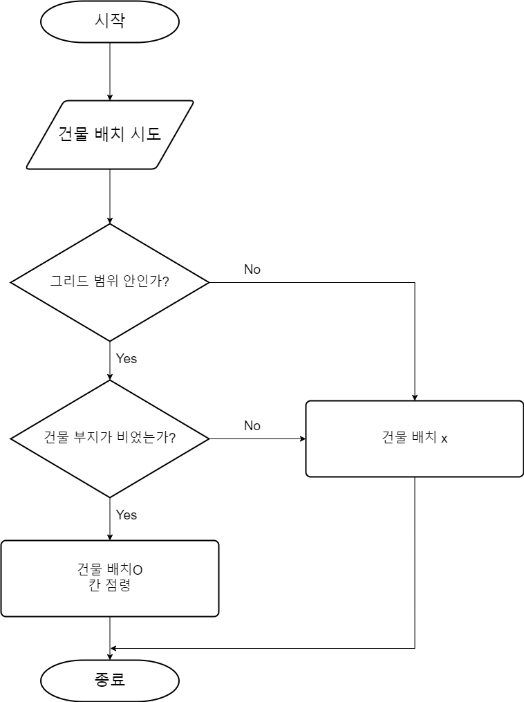  
    
 - **건축 부지**  
    
    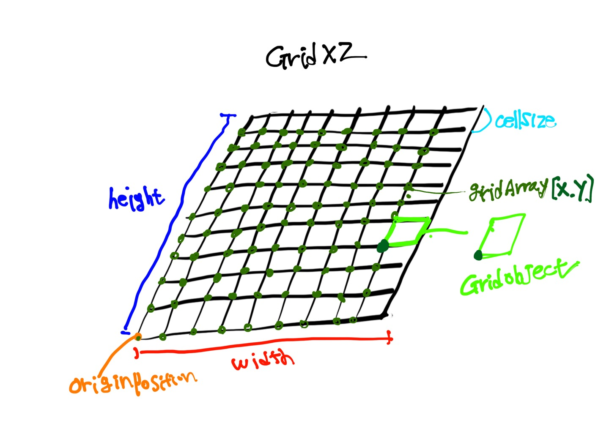  
    
 - **건물**  
   
    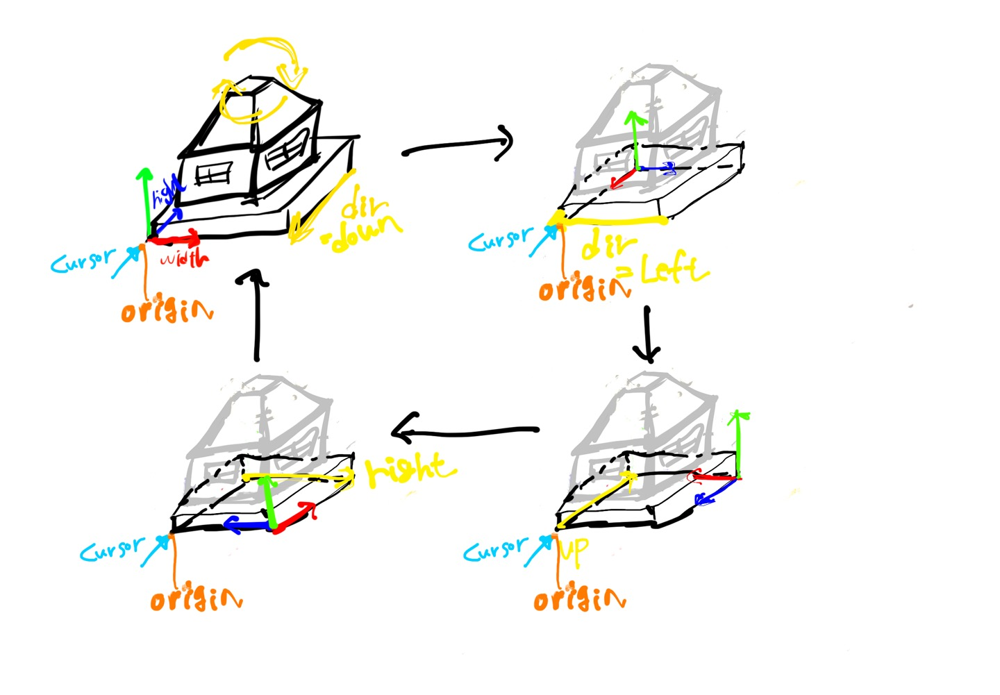  
    </img>
    
 - **클래스 다이어그램**
   
    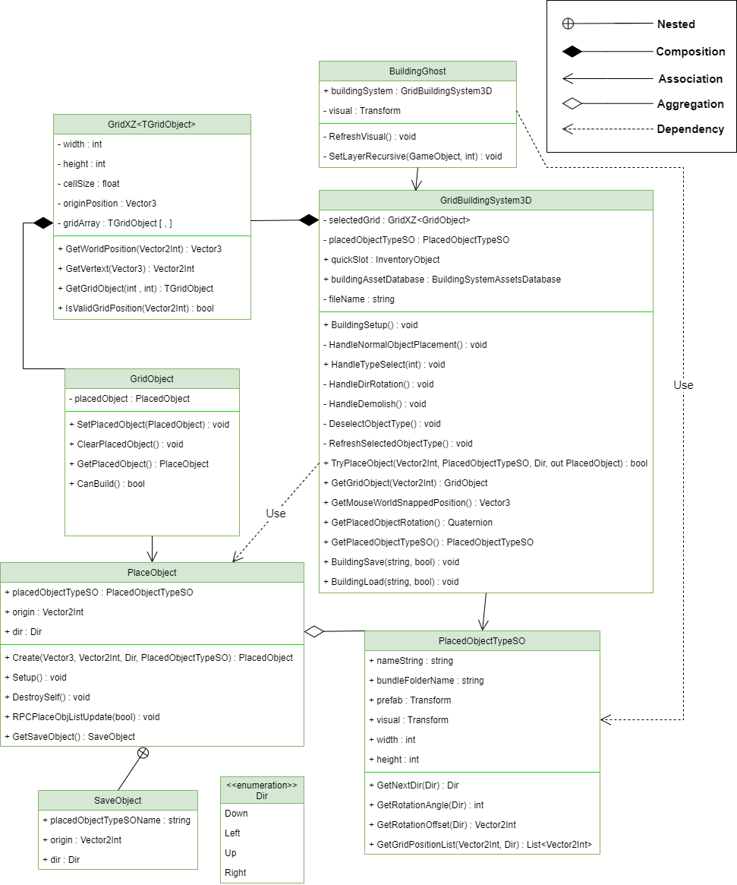  


# 프로젝트 종료 이후 (22.12.18~) 이슈 관리 및 개선 사항  
### (photon) master client 변경시 건물이 중복 생성 및 삭제 불가능한 이슈 [#1](https://github.com/mass1129/MTVS_Nebula/issues/1)  
### 유저월드에 입장할때 먼저 입장한 유저의 아바타가 업데이트가 안되는 이슈 [#2](https://github.com/mass1129/MTVS_Nebula/issues/2)  
### 인벤토리 저장할 때 "부정한 행위가 발생하였습니다"라는 네트워크 오류가 발생하는 이슈 [#3](https://github.com/mass1129/MTVS_Nebula/issues/3)  
### 아이템 시스템 관련 코드 리펙토링 [#4](https://github.com/mass1129/MTVS_Nebula/issues/4)  
### 빌딩시스템 코드 리펙토링 [#5](https://github.com/mass1129/MTVS_Nebula/issues/5)  
### UI관련 코드 리펙토링  [#6](https://github.com/mass1129/MTVS_Nebula/issues/6)
### HTTP 통신 모듈 개선 [#7](https://github.com/mass1129/MTVS_Nebula/issues/7)
### Photon Multiplay 개선 작업 [#8](https://github.com/mass1129/MTVS_Nebula/issues/8)
### 서버 종료에 따른 서버 비의존성 코드 작성 [#9](https://github.com/mass1129/MTVS_Nebula/issues/9)
### 비동기 메서드 무분별 사용 수정 [#10](https://github.com/mass1129/MTVS_Nebula/issues/10)
